# 📘 Data Analytics: Machine Learning – Project Plan

---

## 1. Course Information

- **Course Name:** Data Analytics - Machine Learning 
- **Team Name:** SS Team  

---

## 2. Team Members

| Name | Student ID | Group | Role | Phone |
|------|------------|--------|------|--------|
| **Abduvoxidova Samira** | 202490023 | I24A | Project Leader | +998334140262 |
| **Shodmonova Shahina** | 202490301 | I24A | Data Collection and Analysis | +998950888168 |

---

## 3. Project Title

**Analysis of Smartphone Usage and Addiction Patterns**  

This project analyzes smartpphone usage behavior and examines factors related to smartphone addiction using data analytics techniques.

---

## 4. Dataset Information 

- **Dataset Title:** Smartphone Usage and Addiction Dataset
- **Source Website/URL:**  https://www.kaggle.com/datasets/jayjoshi37/smartphone-usage-and-addiction-prediction/data

- **Description of the dataset:**

The dataset contains information about smartphone usage patterns of users. It includes variables such as age, gender, daily screen time, time spent on
social media, gaming, work or study activities, and weekend screen time. The dataset also includes information about how smartphone usage affects
academic work and the level of smartphone addiction. 

- **Why this dataset was selected:**

This dataset was selected because smartphone addiction has become an important issue in modern society, especially among students and young people.
By analyzing smartphone useage patterns, it is possible to better understand the relationship between screen time, lifestyle habits, 
and addiction levels.

- **Size of dataset(rows,columns):**

Original dataset size: 7500 rows and 16 columns  Dataset used in this project: 50 rows and 10 columns (after data preparation)

---

## 5. Project Objectives

The main objectives of this project is to analyze smartphone usage behavior and identify factors that may be associated with smartphone addiction.

**Problem Statement:** Excessive smartphone usage may negatively affect productivity,academic performance,and overall well-being.

**Research Questions:** 
- How much time do users spend on smartphones daily?
- Does smartphone usage differ between genders?
- Is there a relationship between screen time and smartphone addiction level?
- Does smartphone usage affect academic or work performance?
- How does weekend screen time compare to regular daily usage?

**Expected Insights:**
- Identity pattern of smartphone usage
- Understand the relationship between screen time and addiction level
- Analyze how smartphone usage affects academic or work activities

---

## 6. Data Preparation (Using Pandas)
- **Loading the dataset**
 Download the dataset through website using URL:  https://www.kaggle.com/datasets/jayjoshi37/smartphone-usage-and-addiction-prediction/data

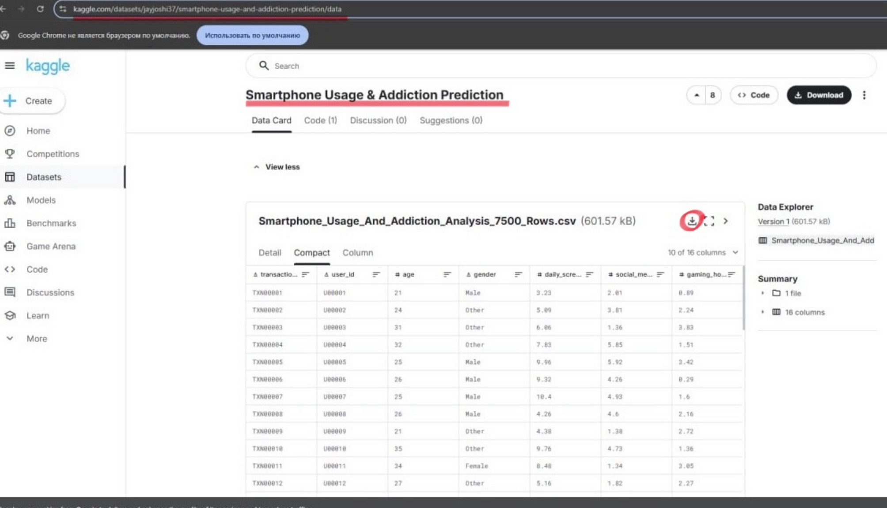

1) First we download all packages and check if requirements are satisfied:

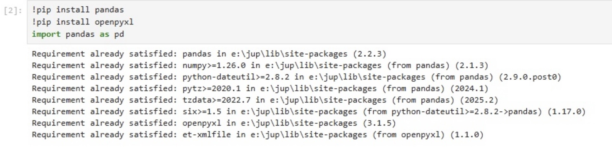

2) Read the data (table)

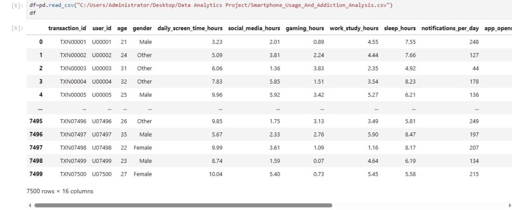

- **Cleaning Data**
1) Redusinng dataset size
 Since the original dataset contains a large number of records, we will take only the first 50 rows to simplify the analysis

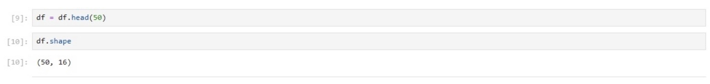

(df.shape is to check the number of columns and rows)

2) Selecting relevant columns

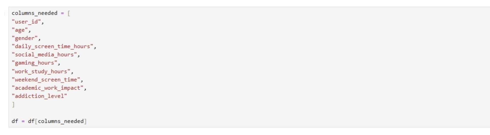

We only chose columns relevant to smartphone usage and addiction for more accurate analysis 

3) Checking for missing values and removing duplicate rows

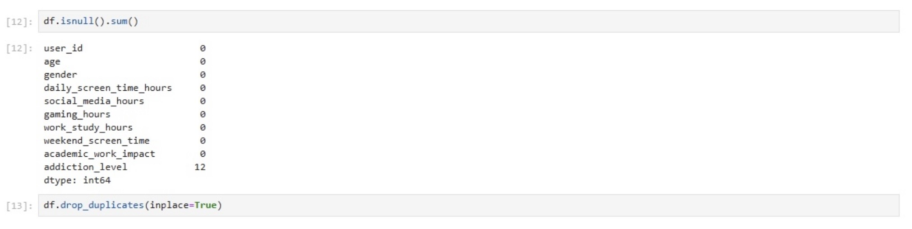

4) Renaming Columns to improve readability

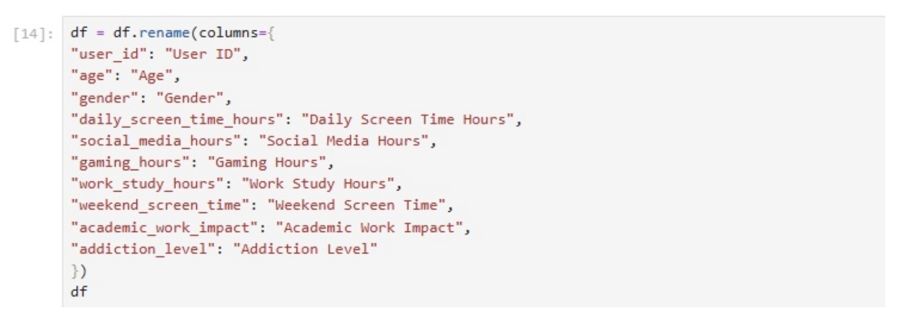

5) Overview of result:

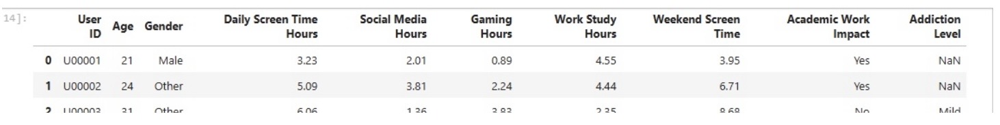

6) Now we can save organized version of our table to our file

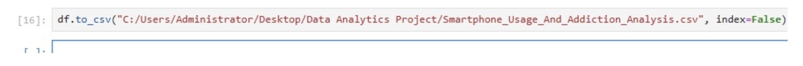

---

## 7. Data Analysis Tasks 

- **Filtering,sorting,grouping**

1) Filtering allows selecting specific rows based on conditions.In this case, users with high smartphone usage were analyzed

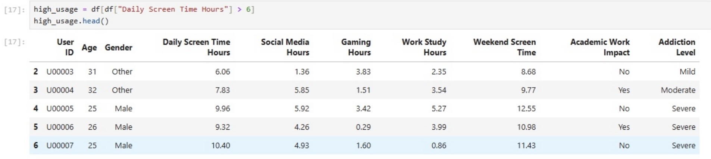

2) Sorting helps identify users with highest daily screen time

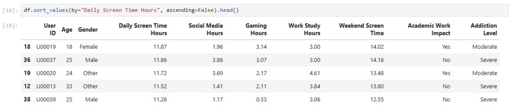

3) groupby()-function groups the data by gender and calculates the average screen time for each group

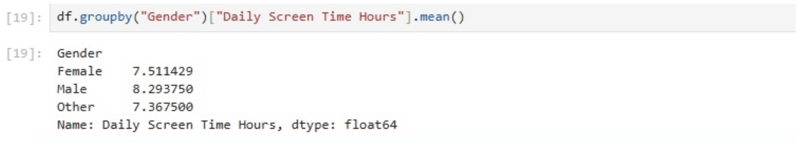

- **Aggregation analysis**
 Aggregation was used to analyze the relationship between smartphone addiction level and screen time.

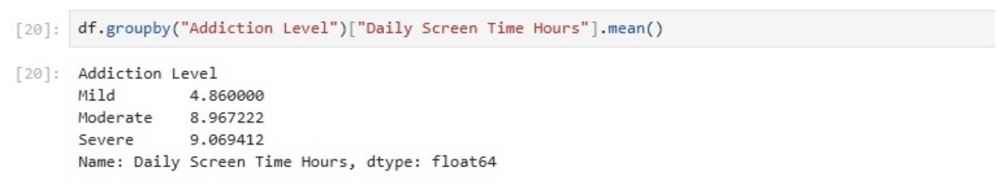

This analysis shows how smartphone usage varies depending on addiction level.

- **Pivot table anaysis**

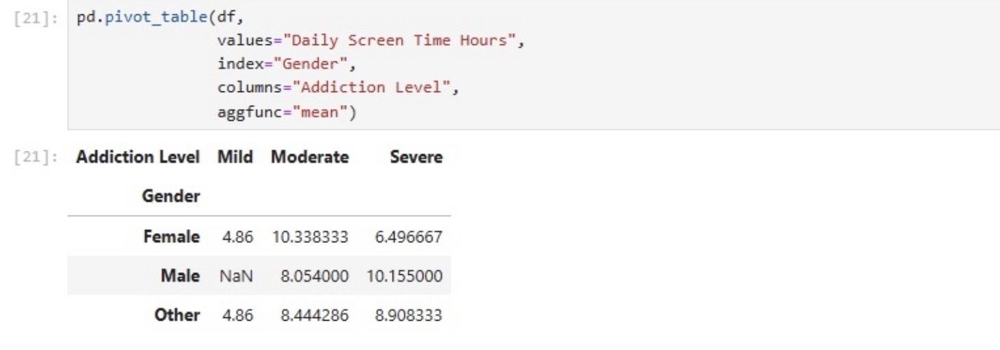

Pivot table was used to summarize the relationship betwenn gender and addiction level

- **Correlation analysis**

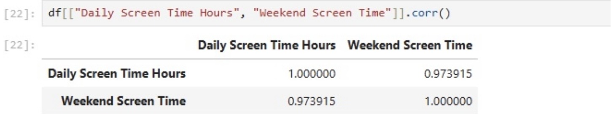

Correlation analysis was performed to examine the relationship between screen time and weekend usage.

- **Results Related to the Research Questions**
 The analysis helps answer the research questions defined in the project objectives:
- Users with higher screen time tend to show higher addiction level
- Smartphone usage patterns vary between users
- Weekend screen time may increase overall smartphone usage
- High smartphone usage may impact academic or work performance

---

## 8. Key Findings and Insights

After performing the data analysis,several important insights were discovered.
- First, users who spend more time on their smartphones tend to have higher addiction levels.The analysis showed that daily screen time increases significantly for users with higher addiction levels.
- Second,smartpone usage patterns vary between genders.The grouping analysis showed significant differences in the average screen time between male and female users.
- Third,weekend screen time contributes to overall smartphone usage.Many users spend more time on their phone during weekends compared to regular weekdays.
- Finally,excessive smartphone usage may have an impact on academic or work performance.Higher screen time is often associated with greater academic work impact levels.
These findings help better understand behavioral patterns related to smartphone usage. 

---

## 9. Project Timeline (5 Weeks)

| Week | Activities |
|------|------------|
| **Week 1** (6 Feb – 13 Feb) | Activities |
| **Week 2** (13 Feb – 20 Feb) | Dataset search and project planning |
| **Week 3** (20 Feb – 27 Feb) | Data cleaning and preparation |
| **Week 4** (27 Feb – 6 Mar) | Data analysis and visualization |
| **Week 5** (6 Mar – 13 Mar) | Report writing and presentation preparation |

---

## 10. Outcome of the Project

Through this project, we gained practical experience in data analysis using the Pandas library in Python. 
 The project helped develop several important skills, including:
- Loading and exploring datasets
- Cleaning and preparing data for analysis
- Using Pandas operations such as filtering, sorting, grouping, and aggregation
- Creating pivot tables
- Visualizing data using charts
I- nterpreting analytical results
 This project also helped us to improve our' ability to work with real-world datasets and extract meaningful insights from data.

---

## 11. Conclusion 

This project analyzed smartphone usage patterns using data analytics techniques. By applying data preparation and analysis methods in Pandas, the dataset was cleaned, simplified, and analyzed to identify key usage trends.

The analysis showed that smartphone addiction is closely related to daily screen time. Users who spend more hours on their smartphones are more likely to have higher addiction levels. Additionally, smartphone usage may influence academic or work productivity.

Overall, this project demonstrates how data analytics can be used to better understand modern digital behavior and identify patterns in smartphone usage.

---

## 12. References 
- Dataset source: Kaggle dataset 
 https://www.kaggle.com/datasets/jayjoshi37/smartphone-usage-and-addiction-prediction/data
- Tutorials: 
 https://youtube.com/@amit.thinks?si=G5otZK6ZoCcn05Am
- Website: chatgpt.com
- Materials for practice from professor Kim Sung Soo

---

## 13. Appendix 

- Important code snippets:

- Additional charts:

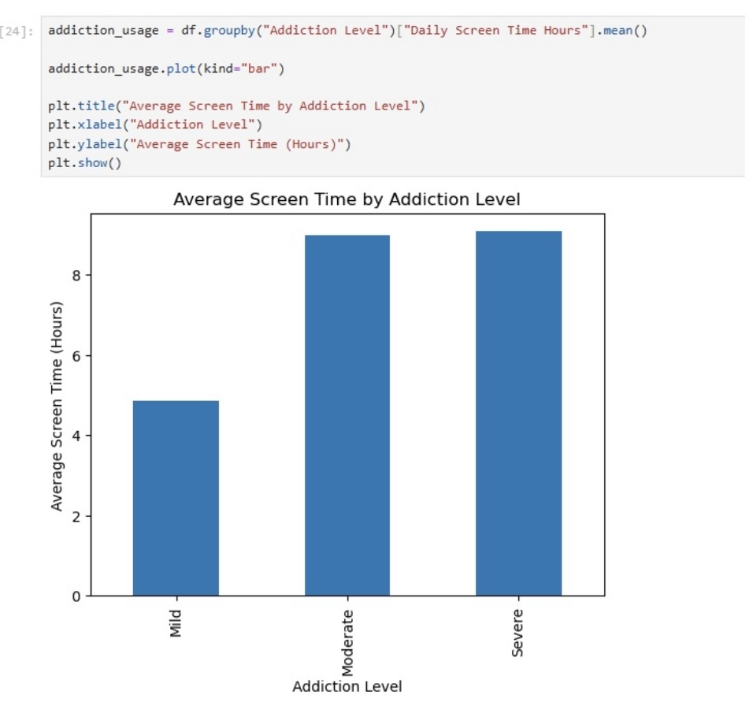

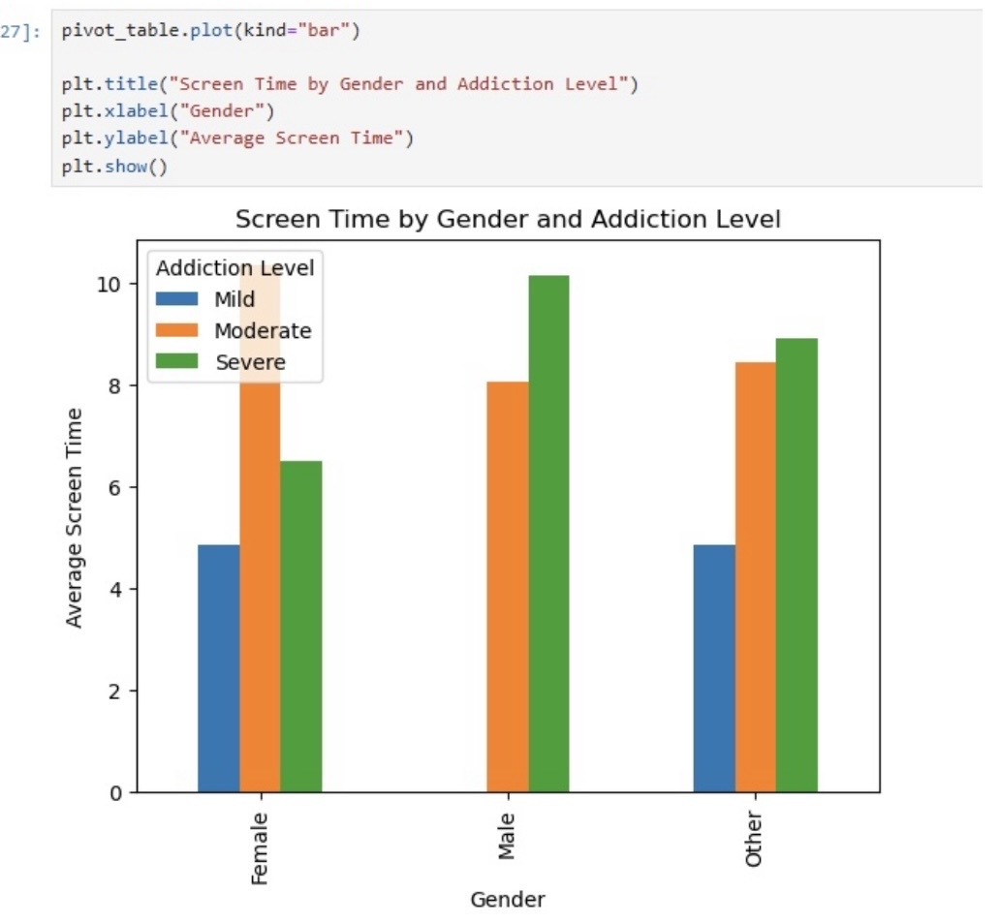
